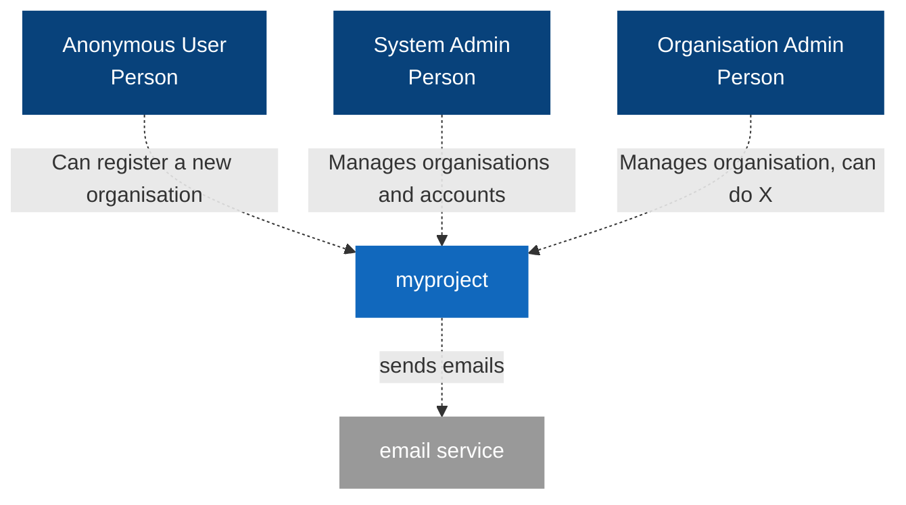

```mermaid
graph TB
  S[myproject]
  M[email service]
  S -.->|sends emails| M
  A[Anonymous User<br/>Person] -.->|Can register a new organisation| S
  B[System Admin<br/>Person] -.->|Manages organisations and accounts| S
  C[Organisation Admin<br/>Person] -.->|Manages organisation, can do X| S
  classDef person fill:#08427b,color:#fff,stroke:none;
  class A,B,C person;
  classDef currentSystem fill:#1168bd,color:#fff,stroke:none;
  class S currentSystem;
  classDef otherSystem fill:#999999,color:#fff,stroke:none;
  class M otherSystem;
```
